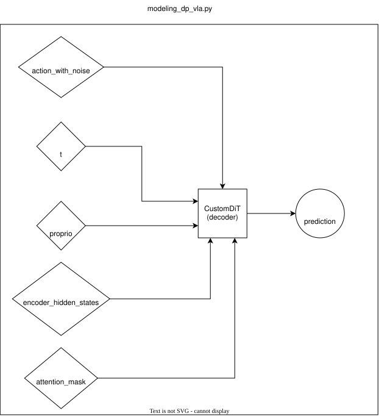
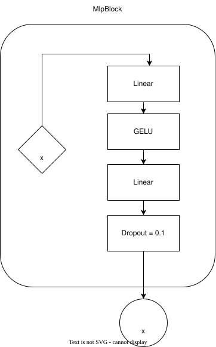
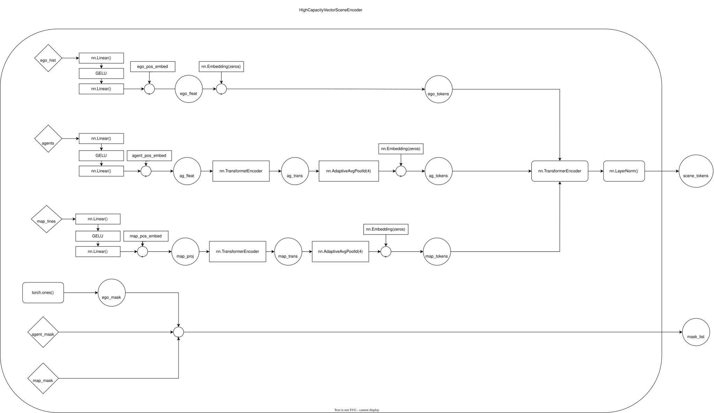

# Marine-Diffusion-Planner
An implementation of Hyper Diffusion Planner (https://arxiv.org/html/2602.22801v1) for marine vehicles

## Table of Contents

- [Model Architecture](#model-architecture)

## Model Architecture

# to-do
Mathematically derive ocean current data from AIS data using :

While standard AIS doesn't tell you the wind or ocean current, you can mathematically infer it by comparing two specific AIS data points:

    Heading (HDG): Where the ship's nose is physically pointing.

    Course Over Ground (COG): The actual path the ship is traveling across the earth.

If a ship's nose is pointing perfectly North (Heading = 0°), but its actual movement across the map is drifting slightly Northeast (COG = 15°), the difference between those two angles is called the drift angle. By combining this drift angle with the ship's Speed Over Ground (SOG), data scientists and oceanographers can mathematically estimate the speed and direction of the ocean currents and wind pushing against that specific ship.

and do something for wind data like pass an empty vector so that model knows that there is some forces acting on ships, this will act as automatic error handelling way, like in PID control Integral term is used for handelling any residue left