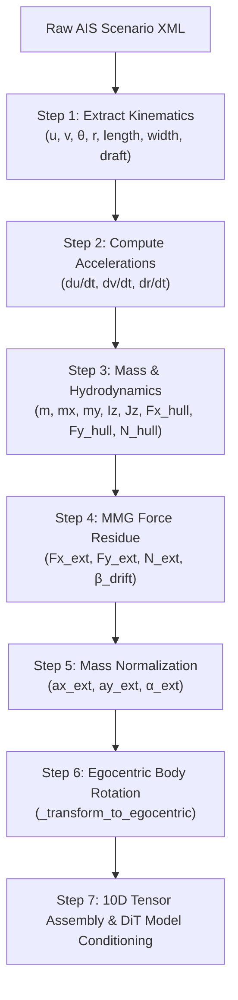

# Step-by-Step Execution Guide: How Code Calculates External Forces

This document provides an in-depth, step-by-step technical walk-through of the exact calculations, Python code paths, and mathematical operations executed in `preparedataset.py` and `train.py` to extract external forces and drift angles.

---

## 1. High-Level Data Flow Overview



---

## 2. Step-by-Step Code Execution Walk-through

### Step 1: Extracting Raw Kinematics & Hull Parameters
**Code Location**: `preparedataset.py`, `__getitem__()` and `_extract_state_features()`

For each vessel state at timestep $t$, the code reads:
- Longitudinal surge velocity $u = \text{state.velocity}$ (m/s)
- Transverse sway velocity $v = \text{state.velocity\_y}$ (m/s)
- Vessel Heading $\theta = \text{state.orientation}$ (radians CCW from East)
- Yaw Rate $r = \text{state.yaw\_rate}$ (rad/s)
- Vessel Dimensions: $L = \text{length}, B = \text{width}, d = \text{draft}$ (meters)

---

### Step 2: Computing World Velocity & Acceleration Differentials
**Code Location**: `preparedataset.py`, lines 122–134

#### A. World Cartesian Velocity Vector $(v_{x,\mathrm{world}}, v_{y,\mathrm{world}})$:
$$\begin{aligned}
v_{x,\mathrm{world}} &= u \cos\theta - v \sin\theta \\
v_{y,\mathrm{world}} &= u \sin\theta + v \cos\theta
\end{aligned}$$

#### B. Course Over Ground ($\mathrm{COG}$):
$$\mathrm{COG} = \mathrm{arctan2}(v_{y,\mathrm{world}}, v_{x,\mathrm{world}})$$

#### C. Discrete Time Acceleration Differentials over $\Delta t = 10.0\text{s}$:
$$\dot{u} = \frac{u_t - u_{t-1}}{\Delta t}, \quad \dot{v} = \frac{v_t - v_{t-1}}{\Delta t}, \quad \dot{r} = \frac{r_t - r_{t-1}}{\Delta t}$$

---

### Step 3: Estimating Mass, Added Mass & Inertia
**Code Location**: `preparedataset.py`, `compute_external_forces()`, lines 19–24

Using seawater density $\rho_w = 1025.0\text{ kg/m}^3$ and block coefficient $C_b = 0.70$:

1. **Vessel Mass ($m$)**:
   $$m = \rho_w \cdot C_b \cdot L \cdot B \cdot d$$
2. **Surge Added Mass ($m_x$)**:
   $$m_x = 0.05 \cdot m$$
3. **Sway Added Mass ($m_y$, Norrbin Approximation)**:
   $$m_y = \rho_w \cdot \frac{\pi}{2} \cdot d^2 \cdot L \cdot \left(1 + 0.4 \frac{B}{L}\right)$$
4. **Yaw Inertia ($I_z$) & Added Inertia ($J_z$)**:
   $$I_z = m \cdot (0.25 L)^2, \quad J_z = 0.025 \cdot m \cdot L^2$$

---

### Step 4: Computing Baseline Hydrodynamic Hull Resistance ($F_{\text{hull}}$)
**Code Location**: `preparedataset.py`, lines 26–29

In calm water, a ship moving through water experiences cross-flow drag and friction:

1. **Surge Resistance ($F_{x,\text{hull}}$)**:
   $$F_{x,\text{hull}} = -\frac{1}{2} \cdot \rho_w \cdot C_{dx} \cdot (B \cdot d) \cdot u \cdot |u| \quad (C_{dx} = 0.03)$$
2. **Sway Cross-Flow Damping ($F_{y,\text{hull}}$)**:
   $$F_{y,\text{hull}} = -\frac{1}{2} \cdot \rho_w \cdot C_{dy} \cdot (L \cdot d) \cdot v \cdot |v| \quad (C_{dy} = 0.80)$$
3. **Yaw Damping Moment ($N_{\text{hull}}$)**:
   $$N_{\text{hull}} = -\frac{1}{16} \cdot \rho_w \cdot C_{dy} \cdot (L^2 \cdot d) \cdot r \cdot |r|$$

---

### Step 5: MMG 3-DOF Inverse Force Residual Calculation
**Code Location**: `preparedataset.py`, lines 31–34

By inverting the MMG ship maneuvering equations of motion, the unexplained external forces pushing the ship are isolated:

$$\begin{aligned}
F_{x,\text{ext}} &= (m + m_x) \dot{u} - (m + m_y) v r - F_{x,\text{hull}} \\
F_{y,\text{ext}} &= (m + m_y) \dot{v} + (m + m_x) u r - F_{y,\text{hull}} \\
N_{\text{ext}} &= (I_z + J_z) \dot{r} - N_{\text{hull}}
\end{aligned}$$

---

### Step 6: Computing Leeway Drift Angle ($\beta_{\text{drift}}$)
**Code Location**: `preparedataset.py`, line 37

The angle difference between actual vessel movement ($\text{COG}$) and bow direction ($\theta$):
$$\beta_{\text{drift}} = \mathrm{wrap\_to\_pi}(\text{COG} - \theta)$$

---

### Step 7: Mass-Normalization to Specific Accelerations
**Code Location**: `preparedataset.py`, line 40

To prevent large container ships ($m \sim 10^8\text{kg}$) from having $1000\times$ larger forces than small boats and disrupting neural network training, we normalize by mass $m$:

$$\begin{aligned}
a_{x,\text{ext}} &= \frac{F_{x,\text{ext}}}{m} \quad (\text{units: }\text{m/s}^2) \\
a_{y,\text{ext}} &= \frac{F_{y,\text{ext}}}{m} \quad (\text{units: }\text{m/s}^2) \\
\alpha_{\text{ext}} &= \frac{N_{\text{ext}}}{m \cdot L} \quad (\text{units: }\text{rad/s}^2)
\end{aligned}$$

This brings force residuals into a bounded, unit scale $\sim [-1.0, 1.0]$.

---

### Step 8: Rotating Force Vectors into Ego-Relative Body Frame
**Code Location**: `preparedataset.py`, `_transform_to_egocentric()`, lines 192–194

To ensure all spatial tensors are expressed relative to the Ego vessel's heading $\theta_{\text{ego}}$ at anchor time $T=0$:

$$\begin{pmatrix} a_{x,\text{rel}} \\ a_{y,\text{rel}} \end{pmatrix} = \begin{pmatrix} \cos(-\theta_{\text{ego}}) & -\sin(-\theta_{\text{ego}}) \\ \sin(-\theta_{\text{ego}}) & \cos(-\theta_{\text{ego}}) \end{pmatrix} \begin{pmatrix} a_{x,\text{ext}} \\ a_{y,\text{ext}} \end{pmatrix}$$

Yaw moment $\alpha_{\text{ext}}$ and drift angle $\beta_{\text{drift}}$ remain invariant scalar quantities.

---

### Step 9: Assembling the 10D State Feature Tensor
**Code Location**: `preparedataset.py`, line 199

The final 10D state vector constructed for each timestamp is:

$$\mathbf{x}_{\text{state}} = [x_{\text{rel}}, y_{\text{rel}}, v_{x,\text{rel}}, v_{y,\text{rel}}, \theta_{\text{rel}}, r, a_{x,\text{rel}}, a_{y,\text{rel}}, \alpha_{\text{ext}}, \beta_{\text{drift}}]$$

Tensors output by `preparedataset.py`:
- `ego_history`: shape `(20, 10)`
- `agents_history`: shape `(10, 20, 10)`
- `ego_target`: shape `(20, 10)`

---

### Step 10: Model Conditioning (`train.py` & `modeling_dp_vla.py`)
**Code Location**: `train.py`, lines 150–257 and `model/modeling_dp_vla.py`

1. **Z-Score Normalization**:
   All 10 feature channels are normalized using dataset mean and standard deviation:
   $$z = \frac{x - \mu}{\sigma + \epsilon}$$
2. **Scene Encoder**:
   `HighCapacityVectorSceneEncoder` projects 10D state vectors via `nn.Linear(10, 128)` into 512-dim tokens.
3. **Proprioception Conditioning Vector**:
   The latest Ego state (including $a_{x,\text{rel}}, a_{y,\text{rel}}, \alpha_{\text{ext}}, \beta_{\text{drift}}$) is passed to `CustomDiT` via `proprio \in \mathbb{R}^{B \times 12}`.
4. **Diffusion Denoising**:
   The DiT model receives $a_{y,\text{rel}}$ and generates collision-free velocity actions with crab-angle counter-steering under heavy sea conditions!

---

## 3. Python Function Call Mapping Table

| Mathematical Step | Python Function Name | Input Arguments | Output Values |
| :--- | :--- | :--- | :--- |
| **Mass & Hydrodynamics** | `compute_external_forces()` | $u, v, r, \dot{u}, \dot{v}, \dot{r}, \theta, \text{COG}, L, B, d$ | $a_{x,\text{ext}}, a_{y,\text{ext}}, \alpha_{\text{ext}}, \beta_{\text{drift}}$ |
| **10D Feature Extraction** | `_extract_state_features()` | `state`, `prev_state`, `dt`, `L`, `B`, `d` | 10D Raw State Vector |
| **Egocentric Frame Transform** | `_transform_to_egocentric()` | `features`, `ego_x`, `ego_y`, `ego_theta` | 10D Relative State Vector |
| **Feature Normalization** | `ZScoreNormalizer.normalize()`| 10D State Tensor | Normalized 10D State Tensor |
| **DiT Conditioning** | `train.py` (`proprio`) | `ego_hist[:, -1, :]` | 12D Conditioning Vector |

---

## 4. Fully Worked Numerical Calculation Example

To demonstrate the exact calculations step-by-step, consider a representative medium-sized cargo vessel under crosswind/wave disturbance:

### Input Kinematics & Dimensions
- **Length** $L = 150.0\text{ m}$, **Width** $B = 25.0\text{ m}$, **Draft** $d = 5.0\text{ m}$
- **Seawater Density** $\rho_w = 1025.0\text{ kg/m}^3$, **Block Coefficient** $C_b = 0.70$
- **Current Kinematics**:
  - $u = 8.0\text{ m/s}$ (longitudinal surge velocity ~15.5 knots)
  - $v = 0.5\text{ m/s}$ (transverse sway velocity ~1 knot)
  - $r = 0.01\text{ rad/s}$ (yaw rate)
  - $\theta = 0.0\text{ rad}$ (heading East)
- **Accelerations over $\Delta t = 10.0\text{s}$**:
  - $\dot{u} = 0.05\text{ m/s}^2$
  - $\dot{v} = 0.02\text{ m/s}^2$
  - $\dot{r} = 0.001\text{ rad/s}^2$

---

### Intermediate Calculation Steps

#### 1. Mass and Mass Inertia Tensor
$$\begin{aligned}
m &= 1025.0 \times 0.70 \times 150.0 \times 25.0 \times 5.0 = 13,453,125.0\text{ kg} \ (\approx 13.45\text{ kilotonnes}) \\
m_x &= 0.05 \times 13,453,125.0 = 672,656.25\text{ kg} \\
m_y &= 1025.0 \times \frac{\pi}{2} \times (5.0)^2 \times 150.0 \times \left(1.0 + 0.4 \frac{25.0}{150.0}\right) = 6,442,750.0\text{ kg} \\
I_z &= 13,453,125.0 \times (0.25 \times 150.0)^2 = 18,918,457,031.25\text{ kg}\cdot\text{m}^2 \\
J_z &= 0.025 \times 13,453,125.0 \times (150.0)^2 = 7,567,382,812.5\text{ kg}\cdot\text{m}^2
\end{aligned}$$

#### 2. Baseline Hull Damping & Cross-Flow Resistance
$$\begin{aligned}
F_{x,\text{hull}} &= -0.5 \times 1025.0 \times 0.03 \times (25.0 \times 5.0) \times 8.0 \times |8.0| = -123,000.0\text{ N} \\
F_{y,\text{hull}} &= -0.5 \times 1025.0 \times 0.80 \times (150.0 \times 5.0) \times 0.5 \times |0.5| = -76,875.0\text{ N} \\
N_{\text{hull}} &= -\frac{1}{16} \times 1025.0 \times 0.80 \times (150.0^2 \times 5.0) \times 0.01 \times |0.01| = -576.56\text{ N}\cdot\text{m}
\end{aligned}$$

#### 3. MMG Inverse Residual Force Calculation
$$\begin{aligned}
F_{x,\text{ext}} &= (13,453,125.0 + 672,656.25) \cdot (0.05) - (13,453,125.0 + 6,442,750.0) \cdot (0.5) \cdot (0.01) - (-123,000.0) \\
&= 706,289.06 - 99,479.38 + 123,000.0 = 729,809.68\text{ N} \\
F_{y,\text{ext}} &= (13,453,125.0 + 6,442,750.0) \cdot (0.02) + (13,453,125.0 + 672,656.25) \cdot (8.0) \cdot (0.01) - (-76,875.0) \\
&= 397,917.50 + 1,129,982.50 + 76,875.0 = 1,604,775.00\text{ N} \\
N_{\text{ext}} &= (18,918,457,031.25 + 7,567,382,812.5) \cdot (0.001) - (-576.56) \\
&= 26,485,839.84 \cdot 0.001 + 576.56 = 27,062.40\text{ N}\cdot\text{m}
\end{aligned}$$

#### 4. Leeway Drift Angle ($\beta_{\text{drift}}$)
$$\begin{aligned}
v_{x,\text{world}} &= 8.0 \cos(0.0) - 0.5 \sin(0.0) = 8.0\text{ m/s} \\
v_{y,\text{world}} &= 8.0 \sin(0.0) + 0.5 \cos(0.0) = 0.5\text{ m/s} \\
\text{COG} &= \text{arctan2}(0.5, 8.0) = 0.062419\text{ rad } (\approx 3.576^\circ) \\
\beta_{\text{drift}} &= \text{wrap\_to\_pi}(0.062419 - 0.0) = 0.062419\text{ rad}
\end{aligned}$$

#### 5. Mass Normalization to Specific Accelerations
$$\begin{aligned}
a_{x,\text{ext}} &= \frac{729,809.68\text{ N}}{13,453,125.0\text{ kg}} = 0.05425\text{ m/s}^2 \\
a_{y,\text{ext}} &= \frac{1,604,775.00\text{ N}}{13,453,125.0\text{ kg}} = 0.11929\text{ m/s}^2 \\
\alpha_{\text{ext}} &= \frac{27,062.40\text{ N}\cdot\text{m}}{13,453,125.0\text{ kg} \times 150.0\text{ m}} = 0.0000134\text{ rad/s}^2
\end{aligned}$$

---

## 5. Edge Cases, Guards & Numerical Stability Handling

`preparedataset.py` implements several defensive measures to ensure robust execution across raw AIS scenarios:

1. **Initial Frame Zero-Acceleration Fallback**:
   When $t=0$, `prev_state` is `None`. Acceleration differentials $\dot{u}, \dot{v}, \dot{r}$ cannot be calculated and default to `0.0`. Hydrodynamic resistance values $F_{\text{hull}}$ still compute based on instantaneous velocities $u, v, r$.

2. **Hull Geometry Bounds Clamp**:
   ```python
   length = max(length, 10.0)
   width = max(width, 2.0)
   draft = max(draft, 1.0)
   ```
   Prevents division-by-zero or non-physical mass calculations if AIS metadata contains missing or corrupted zero-length attributes for small craft.

3. **Continuous Angle Unwrapping**:
   Drift angle calculation uses modulo wrapping:
   ```python
   beta_drift = (cog - heading + np.pi) % (2.0 * np.pi) - np.pi
   ```
   This keeps $\beta_{\text{drift}}$ strictly bounded within $[-\pi, \pi]$, avoiding discontinuities across the $0 \leftrightarrow 2\pi$ boundary.

4. **Sanity Thresholding for Teleporting Vessels**:
   In `_build_index_map()`, if position displacement over a window exceeds $8000.0\text{ m}$ ($8\text{ km}$), the entire window is skipped to prune corrupted AIS signal teleports.

5. **XML DataLoader Fault Tolerance**:
   If an XML scenario fails to load during multi-threaded PyTorch data loading:
   ```python
   except Exception as e:
       return self.__getitem__((idx + 1) % len(self.index_map))
   ```
   The dataset automatically falls back to the next index, avoiding worker crashes during cluster training runs.

---

## 6. Downstream Consumption in Hyper Diffusion Planner (`train.py`)

Once 10D tensors are assembled and rotated into the ego coordinate frame:

```
ego_history shape:   (Batch, Obs_Frames=20, 10)
agents_history shape:(Batch, Max_Agents=10, Obs_Frames=20, 10)
ego_target shape:    (Batch, Pred_Frames=20, 10)
```

1. **Z-Score Feature Standardizing (`ZScoreNormalizer`)**:
   - `mean`: `[0.0, 0.0, 3.5, 0.0, 0.0, 0.0, 0.0, 0.0, 0.0, 0.0]`
   - `std`: `[100.0, 100.0, 3.0, 1.0, 1.0, 0.05, 1.0, 1.0, 0.5, 0.5]`
   Normalized specific force residual channels $a_{x,\text{rel}}, a_{y,\text{rel}}$ are centered near zero with unit variance.

2. **Proprioceptive Conditioning Tensor Construction (`train.py`)**:
   The latest ego status (timestamp $T=0$) is extracted:
   ```python
   dim_state = ego_hist.shape[-1] # 10
   proprio = torch.cat([
       ego_hist[:, -1, :],
       torch.zeros((ego_hist.shape[0], max(0, config.dim_y - dim_state)), device=device)
   ], dim=-1)[:, :config.dim_y] # Shape: (Batch, 12)
   ```

3. **Diffusion Denoising & Steering Control**:
   - The proprioceptive vector containing $a_{x,\text{rel}}, a_{y,\text{rel}}, \alpha_{\text{ext}}, \beta_{\text{drift}}$ is injected directly into `CustomDiT`.
   - The model utilizes these residual forces to modulate generated action sequences ($v_{x}, v_{y}, \theta, r$), ensuring the planned trajectory accounts for environmental drift while preventing phantom sideways steering in calm waters.

---

## 7. Summary & Variable Traceability Matrix

| Physical Symbol | PyTorch/Python Variable | Dimensional Unit (Raw) | Dimensional Unit (Normalized) | Typical Range |
| :--- | :--- | :--- | :--- | :--- |
| $u$ | `u` / `state.velocity` | $\text{m/s}$ | Standardized Z-Score | $[0.0, 15.0]$ |
| $v$ | `v` / `state.velocity_y` | $\text{m/s}$ | Standardized Z-Score | $[-3.0, 3.0]$ |
| $\theta$ | `theta` / `state.orientation` | $\text{rad}$ | Standardized Z-Score | $[-\pi, \pi]$ |
| $r$ | `r` / `state.yaw_rate` | $\text{rad/s}$ | Standardized Z-Score | $[-0.05, 0.05]$ |
| $F_{x,\text{ext}}$ | `Fx_ext` (inside function) | $\text{N}$ | N/A (Converted to $a_x$) | $10^4 \sim 10^7\text{ N}$ |
| $F_{y,\text{ext}}$ | `Fy_ext` (inside function) | $\text{N}$ | N/A (Converted to $a_y$) | $10^4 \sim 10^7\text{ N}$ |
| $N_{\text{ext}}$ | `N_ext` (inside function) | $\text{N}\cdot\text{m}$ | N/A (Converted to $\alpha$) | $10^4 \sim 10^7\text{ N}\cdot\text{m}$ |
| $a_{x,\text{rel}}$ | `rel_fx` / `features[6]` | $\text{m/s}^2$ | Standardized Z-Score | $[-1.0, 1.0]$ |
| $a_{y,\text{rel}}$ | `rel_fy` / `features[7]` | $\text{m/s}^2$ | Standardized Z-Score | $[-1.0, 1.0]$ |
| $\alpha_{\text{ext}}$ | `n_ext` / `features[8]` | $\text{rad/s}^2$ | Standardized Z-Score | $[-0.5, 0.5]$ |
| $\beta_{\text{drift}}$ | `beta` / `features[9]` | $\text{rad}$ | Standardized Z-Score | $[-\pi, \pi]$ |

