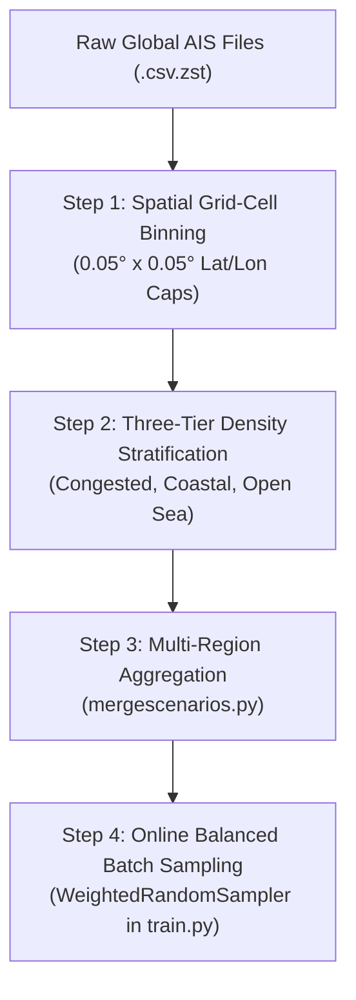

# Spatial & Traffic Density Data Selection Strategy for Multimodal HDP Diffusion Planning

This report details how to construct a spatially diverse, density-stratified AIS dataset that includes **congested ports, narrow channels, and open-sea regions**, enabling the Hyper Diffusion Planner (HDP) to develop emergent multimodal behavior without spatial overfitting.

---

## 1. Theoretical Motivation (HDP Paper Section 4.3)

Section 4.3 of the HDP paper (*Multimodal Capability and Data Scaling*) demonstrates that diffusion models experience **mode collapse** when trained on homogenous or single-location datasets. 

To unleash true multimodal trajectory generation (e.g., predicting multiple plausible paths around obstacles):
- The model must see **diverse spatial contexts**: narrow channels, complex intersections, and wide open-sea transits.
- The dataset must avoid **geographic dominance**: a single high-density port (e.g., Houston or Singapore) must not consume 90% of the training distribution.

---

## 2. Four-Step Implementation Strategy



---

### Step 1: Spatial Grid-Cell Binning (Generator Cap)

#### Concept:
Divide geographical space into discrete grid cells ($\approx 0.05^\circ \times 0.05^\circ$, roughly $5\text{km} \times 5\text{km}$). Limit the maximum scenarios generated per grid cell.

#### Implementation in `SceneriosGenerator/aisdatageneratoroffline.py`:
```python
# Tunable parameter in aisdatageneratoroffline.py:
MAX_SCENARIOS_PER_GRID_CELL = 100  # Cap scenarios per 5km x 5km box

# Grid key calculation per anchor vessel position:
grid_lat_bin = round(origin_lat / LOCAL_BOX_DEG) * LOCAL_BOX_DEG
grid_lon_bin = round(origin_lon / LOCAL_BOX_DEG) * LOCAL_BOX_DEG
grid_key = (grid_lat_bin, grid_lon_bin)

if location_usage[grid_key] >= MAX_SCENARIOS_PER_GRID_CELL:
    stats['skipped_location_overused'] += 1
    continue  # Skip to ensure spatial balance
```

---

### Step 2: Three-Tier Density & Region Stratification

Classify and sample generated scenarios across **three explicit density tiers**:

| Tier | Category | Criteria | Target Ratio | Primary Skill Learned |
| :--- | :--- | :--- | :---: | :--- |
| **Tier 1** | **Congested Ports & Channels** | $N_{\text{vessels}} \ge 5$, Land coastlines within 8km radius | **40%** | Multi-vessel collision avoidance, COLREG yielding, channel keeping |
| **Tier 2** | **Coastal Transit & Intersections** | $2 \le N_{\text{vessels}} < 5$, Turning maneuvers ($\sum \|r\|\Delta t > 10^\circ$) | **40%** | Crossing maneuvers, speed compliance, tactical turns |
| **Tier 3** | **Open Sea Regions** | No coastlines within 8km, $SOG > 3\text{ knots}$, $N_{\text{vessels}} \le 3$ | **20%** | Pure vessel dynamics, high-speed transit, unconstrained multimodal paths |

#### Code Filter Implementation (`aisdatageneratoroffline.py`):
```python
def classify_scenario_tier(n_vessels, has_coastline, total_turn_deg, mean_sog_knots):
    if n_vessels >= 5 and has_coastline:
        return "congested"
    elif not has_coastline and mean_sog_knots > 3.0:
        return "opensea"
    else:
        return "coastal"
```

When saving the scenario XML, tag it in the metadata:
```python
output_file = os.path.join(output_dir, f"scenario_{tier}_{scenario_counter:04d}.xml")
```

---

### Step 3: Multi-Region AIS Aggregation (`helpers/mergescenarios.py`)

Do not rely on a single AIS dataset file. Run scenario generation across **multiple geographically distinct AIS files**:

1. **Port & Channel AIS**: Houston Ship Channel, Singapore Strait, English Channel (`ais_data_houston.csv.zst`).
2. **Coastal Intersections**: Gulf of Mexico coastal routes, East Coast USA transit lanes (`ais_data_coastal.csv.zst`).
3. **Open Sea Transits**: Mid-Gulf / Deepwater Atlantic AIS datasets (`ais_data_opensea.csv.zst`).

Run `helpers/mergescenarios.py` to merge all generated scenario directories into the unified dataset:
```bash
python helpers/mergescenarios.py
```
This moves scenarios from `generated_scenarios_houston`, `generated_scenarios_opensea`, etc., into `all_scenerios/` with unified sequential numbering (`scenario_0001.xml` to `scenario_N.xml`).

---

### Step 4: Online Stratified Batch Sampling (`train.py`)

To ensure every training batch contains a balanced mixture of congested and open-sea scenes:

```python
# In train.py:
from torch.utils.data import WeightedRandomSampler

# Assign sampling weights based on scenario category
sample_weights = []
for item in dataset.index_map:
    file_name = os.path.basename(item['file_path'])
    if 'opensea' in file_name:
        sample_weights.append(2.0)   # Upweight rare open-sea scenarios
    elif 'congested' in file_name:
        sample_weights.append(1.0)   # Standard weight for port scenarios
    else:
        sample_weights.append(1.2)   # Coastal transit

sampler = WeightedRandomSampler(
    weights=sample_weights,
    num_samples=len(sample_weights),
    replacement=True
)

loader = DataLoader(dataset, batch_size=32, sampler=sampler)
```

---

## 3. Summary of Benefits

1. **Eliminates Mode Collapse**: Open-sea data allows the diffusion model to generate diverse candidate trajectories, while congested data enforces safety boundaries.
2. **Geography Agnostic**: Grid-cell capping prevents the model from memorizing specific coastline coordinates.
3. **Balanced Mini-Batches**: Stratified sampling ensures every gradient step updates both high-density multi-agent weights and open-water dynamic weights.
